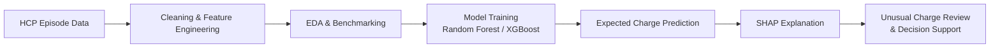

# SJGHC HCP Case Study — Data Scientist (Funding & Costing)

<div align="center">


*▶ 18 analiz grafiği · her kare 3 sn · sonsuz döngü*

</div>

---

> **Adayın Adı:** Osman Orka  
> **Pozisyon:** Data Scientist (Funding & Costing) — St John of God Health Care  
> **Teslim Tarihi:** 30 Haziran 2026, 09:00 AWST  
> **Veri:** HCP (Hospital Casemix Protocol) De-identified Episode Data, 2022–23

---

## 🧭 Sistem Nasıl Çalışıyor?



Bu akış, tamamlanmış bir hasta epizodunun veriden modele, oradan da açıklanabilir charge benchmarking çıktısına nasıl dönüştüğünü gösterir.

## 🎯 Projenin Amacı

De-identified HCP epizod verisinden (~30.6K kayıt × 162 sütun) **ticari etki odaklı** bir analiz çıkarmak ve bunu explainable bir **episode-level charge benchmarking modeli** ile desteklemek. Çıktı: 15 dakikalık yönetim sunumu ve teknik doğrulama paketi.

Ana iş sorusu:
> *"Tamamlanmış bir hasta epizodunun expected billed charge değerini klinik ve operasyonel özelliklerden ne kadar doğru tahmin edebiliriz; bu tahminleri benchmarking ve unusual charge review için nasıl kullanırız?"*

Bu çalışma **admission-time early warning** modeli değildir. `LOS`, `procedure_count`, `comorbidity_count`, `SameDayStatus`, `ModeOfSeparation` ve final DRG/MDC gibi bazı feature'lar epizod tamamlandıktan sonra netleşir. Bu nedenle doğru kullanım alanı:

> **Completed episode charge benchmarking, expected charge estimation and unusual charge review.**

---

## 📁 Klasör Yapısı

```
SJGHC-Case-Study/
├── notebooks/                # 6 ayrı .ipynb (her faz tek dosya)
│   ├── 00_setup_load.ipynb
│   ├── 01_data_understanding.ipynb
│   ├── 02_cleaning_features.ipynb
│   ├── 03_eda.ipynb
│   ├── 04_modeling.ipynb
│   └── 05_outputs_export.ipynb
├── data/
│   ├── raw/                  # ham Excel (gitignored)
│   └── processed/            # parquet (gitignored)
├── figures/                  # sunum için PNG çıktıları
├── reports/                  # spec, metrics, validation CSV/JSON/MD outputs
├── scripts/                  # notebook builders + validation generator
├── requirements.txt
├── .gitignore
└── README.md
```

---

## ⚙️ Kurulum (Sıfırdan Kim Klonlasa Çalıştırabilir)

```bash
# 1) Repoyu klonla
git clone https://github.com/ozzy2438/SJGHC-Case-Study.git
cd SJGHC-Case-Study

# 2) Sanal ortam
python3 -m venv .venv
source .venv/bin/activate         # macOS / Linux
# .venv\Scripts\activate          # Windows

# 3) Bağımlılıklar
pip install -r requirements.txt

# 4) Veriyi yerleştir (DİKKAT: confidential — repoda yok)
#    HCP Dataset for Case Study.xlsx  →  data/raw/  altına kopyala

# 5) Notebook builder scriptlerini çalıştır
python scripts/build_nb00.py
python scripts/build_nb01.py
python scripts/build_nb02.py
python scripts/build_nb03.py
python scripts/build_nb04.py
python scripts/build_nb05.py

# 6) Jupyter / VS Code'da notebook'ları sırayla aç ve çalıştır
#    veya validation pack'i doğrudan üret:
python scripts/generate_validation_outputs.py
```

---

## 🗺️ Yol Haritası (Notebook'a göre)

| Notebook | Amaç | Çıktı |
|----------|------|-------|
| `00_setup_load` | Ortam, veri yükleme, parquet, spec sözlüğü | `hcp.parquet`, `code_dictionary.json` |
| `01_data_understanding` | Boşluk haritası, veri tipleri, kod dağılımları | `data_quality_report.md` |
| `02_cleaning_features` | Tarih parse, LOS, Age, komorbidite/prosedür sayısı, `total_charge_aud`, MDC | Temizlenmiş parquet, `target_composition.csv` |
| `03_eda` | Charge dağılımı, segment farkları, aylık değişim | `figures/*.png` |
| `04_modeling` | Leakage audit, baselines, Random Forest, XGBoost, SHAP, segment validation | `model_comparison.csv`, `segment_performance.csv`, `final_metrics.json` |
| `05_outputs_export` | Sunum için PNG + özet tablo export | `figures/`, `reports/` |

## ✅ Validation Pack

`scripts/generate_validation_outputs.py` şu dosyaları üretir:

| Dosya | İçerik |
|-------|--------|
| `reports/model_comparison.csv` | Mean/median baseline, Linear Regression, Random Forest, XGBoost; random ve time-based split metrikleri |
| `reports/segment_performance.csv` | Same-day, overnight, low/mid/high charge ve MDC bazında MAE/RMSE/R² |
| `reports/data_quality_summary.csv` | Negative LOS, same-day/date mismatch, ICU/theatre consistency, zero charge, whitespace missing, duplicate ID, missing target kontrolleri |
| `reports/feature_list.csv` | 11 model feature'ı, availability ve leakage status |
| `reports/leakage_audit.csv` | Charge/benefit target component kolonlarının feature olarak kullanılmadığını belgeler |
| `reports/high_cost_capture.csv` | Test setindeki üst %10 charge epizodlarını yakalama precision/recall |
| `reports/feature_ablation.csv` | Demographic, clinical, operational ve full feature set performansı |
| `reports/final_metrics.json` | Final model metrikleri ve split bilgileri |
| `reports/limitations.md` | Sunumda açıkça söylenecek limitations |
| `reports/worst_predictions.csv` | Row-level worst prediction review; local-only, public repo için uygun değil |

---

## 🔒 Veri Etiği

- HCP verisi de-identified olsa da hastane kayıtlarıdır → **repoya commit edilmez**.
- `.gitignore` veri dosyalarını ve türetilmiş parquet'leri dışarıda tutar.
- `reports/worst_predictions.csv`, row-level prediction outputs ve `reports/xgb_model.json` public GitHub'a konmamalıdır.
- Sunum/grafiklerde **aggregate** rakamlar gösterilir, ham satır gösterilmez.
- Dataset'teki hedef **charge/billed amount** değeridir; true clinical/economic cost değildir.

---

## 📚 Referanslar

- [HCP Data Specifications 2022–23 (Australian Government)](https://www.health.gov.au/resources/publications/hcp-data-specifications-hospital-to-insurer-2022-23)
- AR-DRG v10.0 sınıflandırması (MDC haritası için)
